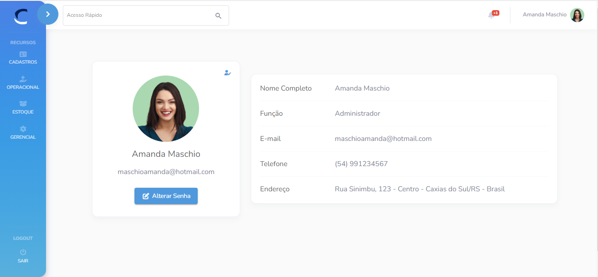
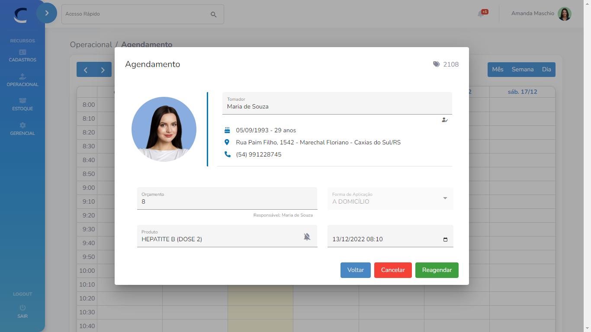
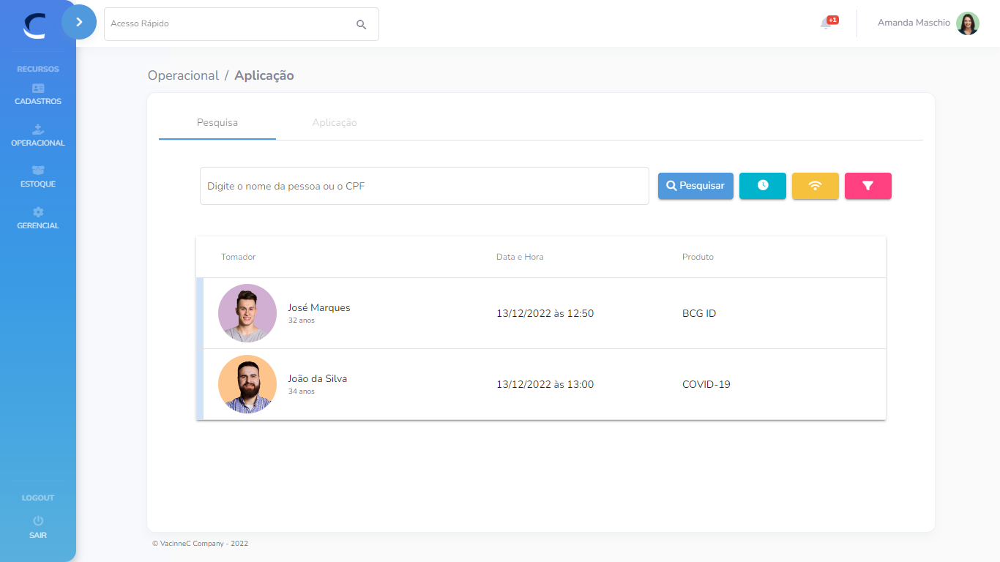

  

  
    
   
   

<h1 align="center">
    
</h1>

<h2 align="center"> 
	VaccineC - Software de Gestão para Clínicas de Vacinação (FRONTEND)
</h2>

 <a href="#-sobre-o-projeto">Sobre</a> •
 <a href="#-funcionalidades">Funcionalidades</a> •
 <a href="#-layout">Layout</a> • 
 <a href="#-tecnologias">Tecnologias</a> • 
 <a href="#-autores">Autores</a> • 
 <a href="#-licença">Licença</a>

## 💻 Sobre o projeto

O Projeto VaccineC surgiu com o propósito de auxiliar clínicas privadas de imunização no gerenciamento de vendas de vacinas, bem como o agendamento e a realização de aplicações.

Foi desenvolvido como trabalho acadêmico, sendo requisito para aprovação e conclusão do curso de Análise e Desenvolvimento de Sistemas da [UNIFTEC - Centro Universitário](https://www.ftec.com.br/), sob orientação do Professor [Thiarlei Machado Macedo](https://www.linkedin.com/in/thiarlei/).

 

> ARTIGO: [VaccineC - Software de Gestão para Clínicas de Vacinação](https://1drv.ms/b/s!AhUeUpwTQPI_yXjraVihgaxDifc0?e=EI1Fgn)

---

## ⚙️ Funcionalidades

- [x] <b>Cadastros:</b>
  - [x] Pessoas
  - [x] Empresas
  - [x] Usuários
  - [x] Produtos
   
  
- [x] <b>Orçamentos:</b>
  - [x] Previsão de venda de produtos e/ou esquemas vacinais
   
 
- [x] <b>Agendamentos:</b>
  - [x] Agendamentos de vacinas e/ou outros para aplicação domiciliar ou na clínica
  - [x] Sugestão de próximas doses
  - [x] Envio de lembretes via SMS
   

- [x] <b>Aplicações:</b>
  - [x] Realização de aplicação de vacinas e/ou outros produtos
  - [x] Comunicação com Mock API, simulando o [SI-PNI](http://pni.datasus.gov.br/) do Ministério da Saúde.
  - [x] Histórico de aplicações
  - [x] Situação das Integrações
   

- [x] <b>Estoque:</b>
  - [x] Movimentação de Estoque - Entrada, Saída e Descarte
  - [x] Gerenciamento de Lotes
  - [x] Baixa automática a cada aplicação realizada
   
  
---

## 🎨 Layout

O Layout da aplicação foi desenvolvido com o auxílio de tecnologias como: [Bootstrap 5](https://getbootstrap.com/), [Angular Material 14](https://material.angular.io/), [Font Awesome V6](https://fontawesome.com/icons).
 

  
  
  

  

---

## 🛠 Tecnologias

As seguintes tecnologias foram utilizadas na construção do projeto:

#### **FRONTEND**

-   **[Angular](https://angular.io/)**
-   **[Typescript](https://www.typescriptlang.org/)**
-   **[Javascript](https://www.javascript.com/)**
-   **[HTML](https://www.w3schools.com/html/)**
-   **[CSS](https://www.w3.org/Style/CSS/Overview.en.html)**
-   **[SASS](https://sass-lang.com/)**

#### **BACKEND**

-   **[C# .NET](https://dotnet.microsoft.com/pt-br/)**
-   **[Entity Framework Core](https://learn.microsoft.com/en-us/ef/core/)**
-   **[Pattern CQRS](https://learn.microsoft.com/en-us/azure/architecture/patterns/cqrs)**

#### **BANCO DE DADOS**

-   **[SQL Server](https://www.microsoft.com/pt-br/sql-server/sql-server-2022)**

#### **UTILITÁRIOS**

-   Protótipos: **[Moqups](https://app.moqups.com/)**
-   APIs: **[SMSDev](https://www.smsdev.com.br/)**, **[ViaCEP](https://viacep.com.br/)**, **[MockAPI](https://mockapi.io/)**
-   Editores: **[Visual Studio Code](https://code.visualstudio.com/)**, **[Visual Studio Community 2022](https://visualstudio.microsoft.com/pt-br/vs/community/)**
-   SGBDs: **[DBeaver](https://dbeaver.io/about/)**, **[SQL Server Management Studio](https://www.microsoft.com/pt-br/sql-server/sql-server-downloads)**
-   Teste de API: **[Postman](https://www.postman.com/)**
-   Frameworks de Design de Interface: **[Bootstrap](https://getbootstrap.com/), [Angular Material](https://material.angular.io/)**
-   Ícones: **[Font Awesome](https://fontawesome.com/icons)**, **[Material Design Icons](https://fonts.google.com/icons)**

> Veja o arquivo  [package.json](https://github.com/amanda-maschio/VaccineC.Web/blob/main/VaccineC/package.json)

---

## 🦸 Autores

Amanda Maschio

 

 

Guilherme Scariot Vargas

 

---

## 📝 Licença

Este projeto está sob licença [MIT](LICENSE.md).
